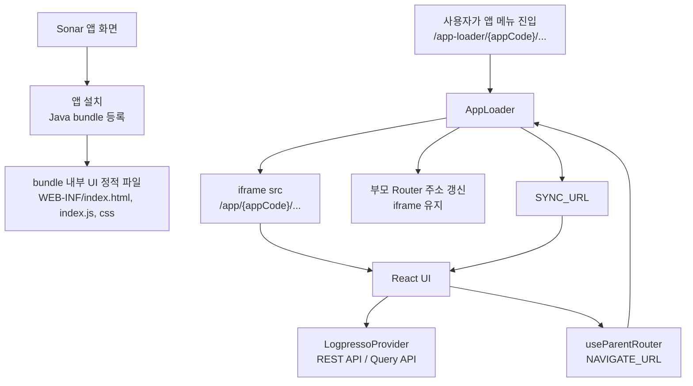

# logpresso React helpers

Sonar 앱을 React로 만들 때 공통으로 필요한 REST API 호출, 쿼리 실행, 부모 셸 라우팅, Sonar v5 스타일 연결을 제공하는 모듈입니다.

이 폴더는 전체 앱 템플릿이 아니라 기존 React 프로젝트에 붙이는 공통 모듈입니다. 앱 엔트리, 라우터, 인증 방식, 번들러 설정은 가져가는 프로젝트에서 결정합니다.

## 사용 범위

이 폴더는 루트 README의 안내에 따라 대상 React 프로젝트로 가져간 뒤 사용하는 공통 모듈입니다.
이 문서에서는 `logpresso/`를 React 앱 코드에서 어떻게 연결하고 호출하는지만 설명합니다.

## 문서

- `README.md`: 사용 범위, 빠른 시작, public API 안내
- `DESIGN.md`: Sonar v5 화면 패턴과 스타일 사용 규칙
- `AGENTS.md`: 이 폴더 내부 작업 규칙

## 구조

```text
logpresso/
  components/
  hooks/
  providers/
  services/
  types/
  utils/
  DESIGN.md
  README.md
  index.ts
  sonar5.css
```

- `services`: Sonar REST API와 query 실행 로직
- `providers`: `LogpressoProvider`
- `hooks`: React hook과 부모 셸 라우팅 연동
- `components`: 공통 UI 보조 컴포넌트
- `utils`: 부모 window locale 등 공통 유틸
- `types`: 외부 공개 타입
- `index.ts`: public export 진입점

## import 경로

프로젝트에서는 `logpresso/`를 가져간 위치와 bundler alias에 맞춰 import 경로를 정합니다.

일반적인 개발 환경에서 `logpresso/`를 `src/logpresso`에 두고 `@`가 `src`를 가리키면 아래처럼 사용합니다.

```ts
import { LogpressoProvider, usePagingQuery } from "@/logpresso";
import "@/logpresso/sonar5.css";
```

이 저장소의 샘플 앱은 루트의 `logpresso/` 원본을 직접 참조하기 위해 Vite alias를 `@logpresso`로 잡습니다.

```ts
import { LogpressoProvider, usePagingQuery } from "@logpresso";
import "@logpresso/sonar5.css";
```

새 앱을 만들 때는 둘 중 하나를 고정해서 사용하고, README 예시의 import 경로만 프로젝트 alias에 맞게 바꿉니다.

## Sonar 앱 로딩 흐름

Sonar에서 React UI는 독립 앱처럼 직접 열리는 것이 아니라, 설치된 Java bundle 안의 정적 UI 파일을 Sonar의 `app-loader`가 iframe으로 올리는 방식으로 실행됩니다.



샘플 앱은 이 흐름을 기준으로 구성되어 있습니다. `VITE_BASE_NAME`은 iframe 안에서 실제 UI가 열리는 `/app/{appCode}/` 경로이고, `VITE_BASE_URL`은 부모 셸 주소에 노출되는 `/app-loader/{appCode}/` 경로입니다.

## 빠른 시작

앱 루트에서 `LogpressoProvider`를 한 번 감싸는 설정이 필수입니다. Provider 아래의 컴포넌트에서만 `useRestApi`, `useQuery`, `usePagingQuery` 같은 hook을 사용할 수 있습니다.

```tsx
import { LogpressoProvider } from "@/logpresso";
import "@/logpresso/sonar5.css";

export default function App() {
  return (
    <LogpressoProvider
      config={{
        baseUrl: import.meta.env.VITE_API_BASE_URL,
        apiKey: import.meta.env.DEV ? import.meta.env.VITE_API_KEY : undefined,
      }}
    >
      {/* 앱 라우터나 실제 화면 컴포넌트 */}
    </LogpressoProvider>
  );
}
```

`config`에서 일반적으로 설정하는 값은 아래 두 가지입니다.

- `baseUrl`: Sonar REST API를 호출할 기준 URL입니다. 같은 origin의 상대 경로를 쓰면 생략할 수 있습니다.
- `apiKey`: 로컬 dev 환경에서 Sonar 계정 API key를 넣어 실제 설치 환경과 같은 권한으로 REST API 호출과 쿼리를 미리 확인할 때 사용합니다.

`apiKey`는 주로 Vite env를 통해 주입합니다. dev 환경에서만 값을 넣고, dev가 아닌 경우에는 비워 둡니다.

```dotenv
VITE_API_BASE_URL=
VITE_API_KEY=dev-account-api-key
```

dev 서버를 `http://localhost:3000`처럼 별도 포트로 열면 브라우저는 Sonar 서버가 아니라 dev 서버로 API를 요청합니다. 서버 통신이 동작하려면 `/api` 요청이 실제 Sonar 서버의 443 포트로 proxy되어야 합니다. 샘플 앱의 `vite.config.ts`에는 `/api`를 `https://localhost:443`으로 넘기는 설정이 들어 있습니다.

앱 설치 이후 Sonar 셸 안에서 실행될 때는 `apiKey`를 비워 두면 로그인한 사용자 계정의 권한을 따라갑니다.

테스트 환경처럼 기본 `fetch` 대신 다른 구현이 필요할 때만 `fetchImpl`을 추가로 넘깁니다.

## Public API

외부 앱은 기본적으로 `index.ts`에서 export하는 API를 사용합니다.

```ts
import {
  AppIcon,
  GlassContainer,
  LogpressoProvider,
  RestApiMethod,
  getSonarLocale,
  usePagingQuery,
  useParentRouteSync,
  useParentRouter,
  useQuery,
  useRestApi,
} from "@/logpresso";
```

주요 항목:

- `AppIcon`: Sonar v5에서 쓰는 `app-icon` 개념을 React/TSX에서 사용할 수 있게 감싼 Material Symbols 아이콘 컴포넌트입니다.
- `LogpressoProvider`: REST API와 query service context를 제공합니다.
- `useRestApi`: Sonar REST API를 직접 호출합니다.
- `useQuery`: 단일 쿼리를 실행하고 결과를 가져옵니다.
- `usePagingQuery`: 쿼리 결과를 offset/limit 기준으로 조회합니다.
- `useParentRouteSync`: 부모 셸에서 전달한 URL 변경을 앱 상태나 라우터에 반영합니다.
- `useParentRouter`: 앱 내부 이동을 부모 셸 URL과 동기화합니다.
- `GlassContainer`: Sonar v5 glass 스타일 프레임을 적용하는 보조 컴포넌트입니다.
- `getSonarLocale`: 부모 window의 `SONAR.locale`을 우선 조회합니다.

### 파일 업로드

`useRestApi`의 `call`은 `POST`, `PUT`, `DELETE` 요청의 파라미터를 `FormData`로 전송합니다.
값에 `File` 또는 `Blob`을 넘기면 문자열로 변환하지 않고 multipart 파일 필드로 붙입니다.

```tsx
import { RestApiMethod, useRestApi } from "@/logpresso";

function RuleUpload() {
  const { call } = useRestApi();

  const upload = async (file: File) => {
    await call?.(RestApiMethod.POST, "/file-upload/rule", {
      file,
    });
  };

  return (
    <input
      type="file"
      accept=".zip"
      onChange={(event) => {
        const file = event.currentTarget.files?.[0];
        if (file) {
          upload(file);
        }
      }}
    />
  );
}
```

동일한 필드명으로 여러 값을 보내야 하면 배열을 넘깁니다.

## 호스트 앱이 준비할 것

- React 앱 엔트리와 화면 컴포넌트 구조
- 번들러 설정과 `@/logpresso` 또는 `@logpresso` 같은 module alias
- 라우터 연결 또는 URL 상태 동기화 방식
- Sonar API base URL 또는 토큰 주입 방식
- Sonar 셸에서 사용할 `VITE_BASE_NAME`, `VITE_BASE_URL`
- `sonar5.css`를 사용할 경우 `/assets/fonts/Pretendard-*.woff2`, `/assets/fonts/D2Coding.woff2`
- `AppIcon`을 사용할 경우 `Material Symbols Outlined` 폰트
- `sonar5.css`가 참조하는 아이콘 자산을 그대로 쓸 경우 `/icons/highlight_off.svg`

## Sonar 셸 환경변수

Sonar 셸 또는 부모 프레임 안에서 동작하는 앱은 `VITE_BASE_NAME`과 `VITE_BASE_URL`을 실제 배포 경로와 맞춥니다.

```dotenv
VITE_BASE_NAME=/app/sample-app/
VITE_BASE_URL=/app-loader/sample-app/
```

- `VITE_BASE_NAME`: 앱 내부 라우트와 정적 asset 경로 기준
- `VITE_BASE_URL`: 부모 셸에 전달할 loader URL 기준

이 값은 아래 코드와 직접 연결됩니다.

- `useParentRouteSync`의 `appBase`
- `useParentRouter`의 `loaderBase`
- `import.meta.env.VITE_BASE_NAME`를 쓰는 asset 경로

## Sonar 셸 라우팅

부모 셸과 URL을 맞춰야 하는 앱은 앱 루트에서 `useParentRouteSync`를 한 번 등록하고, 내부 이동에는 `useParentRouter`가 반환한 함수를 사용합니다.

`logpresso`는 앱 전체 라우터를 대체하지 않습니다. React Router, TanStack Router, 탭 기반 상태 관리 등 호스트 앱의 기존 이동 함수를 연결하는 방식을 기본으로 합니다.

권장 배치:

- `useParentRouteSync`: `App.tsx`, 루트 레이아웃, 전역 provider 아래 같은 앱의 메인 진입 지점에서 등록합니다.
- `useParentRouter`: 버튼 클릭, 메뉴 이동, 탭 전환처럼 실제 이동이 발생하는 화면 컴포넌트에서 사용합니다.

특정 페이지 안에서만 `useParentRouteSync`를 호출하면 라우트 구조에 따라 리스너가 중복 등록되거나 일부 화면에서만 동기화가 동작할 수 있습니다.

```tsx
import { useState } from "react";
import { useParentRouteSync, useParentRouter } from "@/logpresso";

function App() {
  const [activePath, setActivePath] = useState("/list");

  useParentRouteSync({
    appBase: import.meta.env.VITE_BASE_NAME,
    onSync: setActivePath,
  });

  const parentRouter = useParentRouter({
    navigate: setActivePath,
    loaderBase: import.meta.env.VITE_BASE_URL,
    isProduction: import.meta.env.PROD,
  });

  return <button onClick={() => parentRouter("/query")}>쿼리</button>;
}
```

React Router를 쓰면 `navigate`를 넘기고, 별도 라우터 없이 탭/상태로 화면을 바꾸는 앱이면 `onSync` 콜백을 넘깁니다.

```tsx
import { Outlet, useNavigate } from "react-router-dom";
import { useParentRouteSync, useParentRouter } from "@/logpresso";

function AppRouteSync() {
  const navigate = useNavigate();

  useParentRouteSync({
    navigate,
    appBase: import.meta.env.VITE_BASE_NAME,
  });

  return null;
}

function AppShell() {
  const navigate = useNavigate();

  const router = useParentRouter({
    navigate,
    loaderBase: import.meta.env.VITE_BASE_URL,
    isProduction: import.meta.env.PROD,
  });

  return (
    <>
      <AppRouteSync />
      <nav>
        <button onClick={() => router("/queries")}>쿼리 목록</button>
      </nav>
      <Outlet />
    </>
  );
}
```

## 스타일 통합

Sonar v5의 시각 규칙과 화면 패턴은 `DESIGN.md`를 기준으로 맞춥니다.

- 공통 스타일은 `sonar5.css`를 가져다 쓰되, 프로젝트 전역 디자인 시스템을 강제하는 용도로 사용하지 않습니다.
- glass 표현이 필요한 경우에는 마크업을 각 화면마다 직접 조합하기보다 public export의 `GlassContainer`를 우선 사용합니다.
- public API가 바뀌면 `index.ts` export와 README 예시를 함께 확인합니다.
- 다른 프로젝트로 복사될 수 있으므로 import 경로와 파일 경계가 과도하게 앱 전용으로 변하지 않았는지 확인합니다.

## 샘플 앱

`main` 브랜치의 `sonar-sample-app/`은 이 모듈을 실제 Sonar 앱처럼 붙인 참고 예제입니다.

- `LogpressoProvider` 연결
- `useRestApi` 기반 REST API 호출
- `usePagingQuery` 기반 쿼리 실행
- `useParentRouteSync`, `useParentRouter` 기반 부모 라우팅 동기화
- `GlassContainer`, `sonar5.css` 기반 Sonar v5 화면 패턴

샘플은 공통 모듈 사용 방향을 보여주는 예제이며, 실제 앱에서는 프로젝트의 라우터, 인증, 배포 경로에 맞춰 조정합니다.
